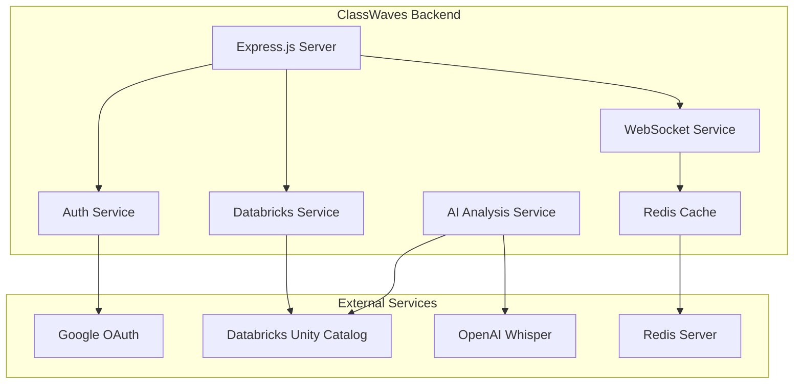
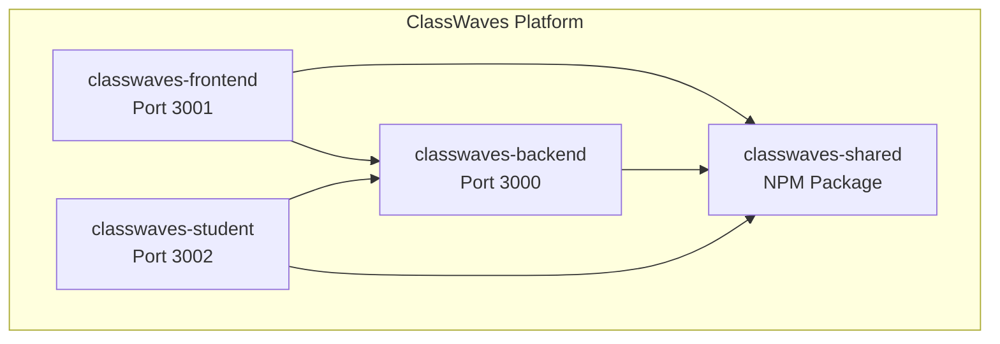

# ClassWaves Backend

<div align="center">


**Educational platform backend service for real-time classroom collaboration with AI-powered insights**

[Features](#features) • [Quick Start](#quick-start) • [API Documentation](#api-documentation) • [Database](#database-architecture) • [Testing](#testing)

</div>

## Table of Contents

- [Features](#features)
- [Architecture Overview](#architecture-overview)
- [Database Architecture](#database-architecture)
- [Quick Start](#quick-start)
- [API Documentation](#api-documentation)
- [WebSocket Events](#websocket-events)
- [Admin Controls](#admin-controls)
- [Testing](#testing)
- [Security & Compliance](#security--compliance)
- [Monitoring & Health](#monitoring--health)
- [Development](#development)
- [Deployment](#deployment)
- [Repository Integration](#repository-integration)
- [Contributing](#contributing)

## Features

🎯 **Core Capabilities**
- **Real-time Collaboration**: WebSocket-powered classroom sessions
- **AI-Powered Analytics**: Two-tier AI analysis system with Databricks
- **Speech-to-Text**: OpenAI Whisper integration for live transcription
- **Group-Centric Design**: Focus on group interactions, not individual tracking
- **FERPA/COPPA Compliant**: Built-in educational privacy protections

🏗️ **Technical Features**
- **Unity Catalog Database**: 27 tables across 10 schemas
- **Google Workspace Auth**: Seamless school integration
- **Rate Limiting & Security**: Enterprise-grade protection
- **Real-time Monitoring**: Health checks and performance metrics
- **Comprehensive Testing**: Unit, integration, and E2E tests

## Architecture Overview

### Technology Stack
- **Framework:** Express.js with TypeScript
- **Database:** Databricks Unity Catalog (Delta Lake)
- **Authentication:** Google OAuth 2.0 with JWT
- **STT Provider:** OpenAI Whisper API with windowed batching
- **Real-time:** Socket.IO with Redis adapter
- **AI Integration:** OpenAI Whisper + Databricks Llama models
- **Caching:** Redis for sessions and rate limiting
- **Testing:** Jest, Supertest, and Playwright integration

### Service Dependencies



## Database Architecture

### Unity Catalog Structure
- **Catalog:** `classwaves`
- **Total Schemas:** 10
- **Total Tables:** 27
- **Compliance:** Full FERPA/COPPA support

#### Schema Overview
| Schema | Purpose | Tables | Key Features |
|--------|---------|--------|-------------|
| `users` | User Management | schools, teachers, students | Google Workspace integration |
| `sessions` | Session Management | sessions, groups, recordings | Real-time collaboration |
| `analytics` | Performance Data | session_analytics, group_metrics | AI-powered insights |
| `compliance` | Privacy & Audit | audit_log, consent_tracking | FERPA/COPPA compliance |
| `ai_insights` | AI Analysis | tier1_insights, tier2_insights | Two-tier AI system |
| `operational` | System Operations | system_events, health_metrics | Monitoring & alerting |
| `admin` | Administration | admin_actions, system_config | Super admin controls |
| `communication` | Messaging | notifications, alerts | Teacher guidance |
| `audio` | Audio Processing | transcriptions, audio_metadata | Speech-to-text |
| `notifications` | Real-time Updates | delivery_queue, preferences | WebSocket integration |

### Database Management Scripts
```bash
# Create complete database structure
npm run db:create-catalog

# Verify database integrity
npm run db:verify

# Run comprehensive audit
npm run db:audit

# Display current structure
npm run db:show

# Check connection and state
npm run db:health-check
```

## Phase 4: OpenAI Whisper STT Integration

**Migration Status**: ✅ **Complete** - Databricks waveWhisperer fully replaced

### Key Features
- **Zero-disk audio processing**: All audio handled in-memory only
- **Windowed batching**: Configurable 10-20s windows for cost optimization  
- **Budget controls**: Per-school daily limits with automatic alerting
- **Classroom scale**: Tested for 25+ concurrent groups
- **FERPA compliant**: No persistent audio storage, immediate buffer cleanup

### STT Architecture
```
WebSocket Audio Chunks → In-Memory Aggregator → OpenAI Whisper API → Live Transcription
```

**Benefits over Databricks waveWhisperer**:
- Lower latency and cost
- Better reliability and scaling
- Industry-standard OpenAI integration
- Comprehensive budget monitoring

## Quick Start

### Prerequisites
- **Node.js**: 18+ (recommended: 20+)
- **Databricks**: Unity Catalog workspace access
- **Google Cloud**: OAuth 2.0 project setup
- **Redis**: For session storage and caching
- **OpenAI**: API key for Whisper transcription

### Environment Setup

Create a `.env` file with the following configuration:

```bash
# === Server Configuration ===
NODE_ENV=development
PORT=3001

# === Databricks Configuration ===
DATABRICKS_HOST=https://dbc-d5db37cb-5441.cloud.databricks.com
DATABRICKS_TOKEN=your-token-here
DATABRICKS_WAREHOUSE_ID=077a4c2149eade40

# === OpenAI Whisper Configuration ===
OPENAI_API_KEY=your-openai-key
OPENAI_WHISPER_TIMEOUT_MS=15000
OPENAI_WHISPER_CONCURRENCY=20
STT_WINDOW_SECONDS=15
STT_PROVIDER=openai # Options: 'openai' | 'off'
STT_BUDGET_MINUTES_PER_DAY=0 # 0 = unlimited
STT_BUDGET_ALERT_PCTS=50,75,90,100

# === Google OAuth Configuration ===
GOOGLE_CLIENT_ID=your-client-id
GOOGLE_CLIENT_SECRET=your-client-secret

GOOGLE_REDIRECT_URI=http://localhost:3001/api/auth/google/callback

# === Security Configuration ===
SESSION_SECRET=your-session-secret
JWT_SECRET=your-jwt-secret

# === Integration URLs ===
FRONTEND_URL=http://localhost:3000
STUDENT_APP_URL=http://localhost:3002

# === Redis Configuration ===
REDIS_URL=redis://localhost:6379
REDIS_PASSWORD=
```

### Installation & Setup

```bash
# Clone and install dependencies
git clone <repository-url>
cd classwaves-backend
npm install

# Set up database
npm run db:create-catalog
npm run db:verify

# Start development server
npm run dev
```

### Verification
```bash
# Check server health
curl http://localhost:3001/api/v1/health

# Verify database connection
npm run db:health-check

# Run test suite
npm test
```

## API Documentation

### Authentication Endpoints
| Method | Endpoint | Description | Auth Required |
|--------|----------|-------------|---------------|
| `POST` | `/api/v1/auth/google` | Initiate Google OAuth flow | No |
| `GET` | `/api/v1/auth/google/callback` | OAuth callback handler | No |
| `POST` | `/api/v1/auth/refresh` | Refresh JWT token | Yes |
| `POST` | `/api/v1/auth/logout` | Logout user | Yes |

### Session Management
| Method | Endpoint | Description | Auth Required |
|--------|----------|-------------|---------------|
| `GET` | `/api/v1/sessions` | List teacher's sessions | Teacher |
| `POST` | `/api/v1/sessions` | Create new session | Teacher |
| `GET` | `/api/v1/sessions/:id` | Get session details | Teacher |
| `PUT` | `/api/v1/sessions/:id` | Update session | Teacher |
| `POST` | `/api/v1/sessions/:id/start` | Start session | Teacher |
| `POST` | `/api/v1/sessions/:id/end` | End session | Teacher |
| `GET` | `/api/v1/sessions/:id/analytics` | Session analytics | Teacher |

### AI Analysis System
| Method | Endpoint | Description | Auth Required |
|--------|----------|-------------|---------------|
| `POST` | `/api/v1/ai/analyze-discussion` | **Tier 1 group analysis (Frontend-Compatible)** | Teacher |
| `POST` | `/api/v1/ai/generate-insights` | **Tier 2 deep analysis (Frontend-Compatible)** | Teacher |
| `GET` | `/api/v1/ai/insights/:sessionId` | **Retrieve session insights (Frontend-Compatible)** | Teacher |
| `GET` | `/api/v1/ai/tier1/status` | Tier 1 system status | Teacher |
| `GET` | `/api/v1/ai/tier2/status` | Tier 2 system status | Teacher |

#### Route Standardization (December 2024)
**Frontend-Compatible Routes**: The above endpoints are standardized for seamless frontend integration. 

**Backward Compatibility**: Legacy routes are maintained for existing integrations:
- `POST /api/v1/ai/sessions/:sessionId/analyze-discussion`
- `POST /api/v1/ai/sessions/:sessionId/generate-insights` 
- `GET /api/v1/ai/sessions/:sessionId/insights`

**Migration Benefits**:
- ✅ Zero breaking changes for existing code
- ✅ Simplified frontend API client patterns
- ✅ Consistent route structure across all AI endpoints
- ✅ Enhanced error logging and debugging capabilities

### Analytics & Monitoring
| Method | Endpoint | Description | Auth Required |
|--------|----------|-------------|---------------|
| `GET` | `/api/v1/analytics/session/:id` | Session analytics | Teacher |
| `GET` | `/api/v1/analytics/system` | System analytics | Admin |
| `GET` | `/api/v1/health` | Basic health check | No |
| `GET` | `/api/v1/health/guidance` | Detailed system health | Teacher |
| `GET` | `/api/v1/health/components` | Component health | Admin |

### Admin Controls (Super Admin Only)
| Method | Endpoint | Description | Auth Required |
|--------|----------|-------------|---------------|
| `GET` | `/api/v1/admin/schools` | List all schools | Super Admin |
| `POST` | `/api/v1/admin/schools` | Create school | Super Admin |
| `PUT` | `/api/v1/admin/schools/:id` | Update school | Super Admin |
| `GET` | `/api/v1/admin/analytics` | Platform analytics | Super Admin |

## WebSocket Events

### Real-time Communication
The backend uses Socket.IO for real-time communication with the frontend and student applications.

#### Server-to-Client Events
```typescript
// Group-based events
'group:joined': { groupId: string; sessionId: string; groupInfo: any }
'group:status_changed': { groupId: string; status: string; isReady?: boolean }

// Transcription events
'transcription:group:new': {
  id: string;
  groupId: string;
  text: string;
  timestamp: string;
  confidence: number;
}

// AI insights
'insight:group:new': {
  groupId: string;
  insightType: 'argumentation_quality' | 'collaboration_patterns';
  message: string;
  severity: 'info' | 'warning' | 'success';
}

// Teacher guidance
'teacher:alert:immediate': { alert: GuidanceAlert }
'teacher:prompt:acknowledged': { promptId: string; timestamp: string }
```

#### Client-to-Server Events
```typescript
// Session management
'session:join': { sessionId: string }
'session:leave': { sessionId: string }

// Group management
'group:join': { groupId: string; sessionId: string }
'group:status_update': { groupId: string; status: string }

// Audio streaming
'audio:chunk': { groupId: string; audioData: Buffer }
'audio:start': { groupId: string; format: string }
'audio:stop': { groupId: string }
```

## Admin Controls

### Super Admin Features
- **School Management**: Create, update, and monitor schools
- **User Administration**: Manage teacher accounts and permissions
- **System Analytics**: Platform-wide usage and performance metrics
- **Compliance Monitoring**: FERPA/COPPA audit trails and reporting
- **Subscription Management**: Handle billing and limits

### Admin Dashboard Access
Super admin users can access:
- Complete audit logs (`compliance.audit_log`)
- System performance metrics
- School-level analytics
- User activity monitoring
- Data retention policy management

### Security Controls
- Role-based access control (teacher, admin, super_admin)
- Comprehensive audit logging
- Rate limiting per user and endpoint
- IP allowlisting for admin functions
- Session management and token validation

## Testing

### Testing Philosophy: Real Database Integration

ClassWaves follows a **real database integration testing** approach for MVP validation, prioritizing **production confidence** over test isolation.

### Environment-Specific Testing

#### Backend Server Setup for Tests

```bash
# For integration/E2E tests (RECOMMENDED)
NODE_ENV=test E2E_TEST_SECRET=test npm run dev

# For regular development work
NODE_ENV=development npm run dev

# For production deployment
NODE_ENV=production npm run start
```

#### Environment Comparison

| Environment | Database | Authentication | Redis | Use Case |
|-------------|----------|----------------|-------|----------|
| **`test`** | ✅ Real Databricks | Relaxed (test tokens) | ✅ Real Redis | Integration & E2E testing |
| **`development`** | ✅ Real Databricks | Full OAuth flow | ✅ Real Redis | Regular development |
| **`production`** | ✅ Real Databricks | Full OAuth + security | ✅ Real Redis | Live deployment |

#### Why Real Database Testing?

**MVP Validation Benefits**:
- 🎯 **Schema Validation**: Catches real database schema mismatches
- 🎯 **Network Reality**: Tests actual latency, timeouts, and connection issues  
- 🎯 **Retry Logic**: Validates resilience infrastructure with real service failures
- 🎯 **Performance Truth**: Load testing with actual database constraints
- 🎯 **Configuration Issues**: Discovers real-world connection and auth problems

**Authentication in Test Environment**:
- Uses mocked `authenticate` middleware for automated test execution
- Maintains real service connections (Databricks, Redis, WebSocket)
- Allows test token generation without full Google OAuth flow
- Enables CI/CD automation while preserving integration fidelity

### Test Suite Structure
```
src/__tests__/
├── integration/          # Real database integration tests
│   ├── auth.test.ts         # Authentication flows
│   ├── session-start-resilience.test.ts  # Retry infrastructure validation
│   ├── ai-analysis-load.test.ts          # Load testing with real services
│   ├── guidance-system-concurrent.test.ts # Concurrent system testing
│   ├── analytics-tracking.e2e.test.ts    # End-to-end analytics flow
│   └── routes/              # API route testing with real DB
├── unit/                # Isolated unit tests (mocked dependencies)
│   ├── services/        # Service layer logic tests
│   ├── controllers/     # Controller business logic  
│   └── middleware/      # Middleware function tests
├── e2e/                 # Complete user workflow tests
│   └── e2e-guidance-complete-workflow.test.ts
├── fixtures/            # Test data and schemas
│   └── test-data.ts
└── mocks/              # Service mocks (for unit tests only)
    ├── databricks.mock.ts
    └── redis.mock.ts
```

### Running Tests

#### Integration & E2E Tests (Real Services)
```bash
# Start backend in test mode first
NODE_ENV=test E2E_TEST_SECRET=test npm run dev

# In separate terminal, run integration tests
npm run test:integration

# Run specific resilience tests
npm run test:integration -- --testNamePattern="Session Start Resilience"

# Run E2E workflow tests  
npm run test:e2e
```

#### Unit Tests (Mocked Dependencies)
```bash
# Unit tests don't require backend server
npm run test:unit

# Watch mode for TDD
npm run test:unit -- --watch
```

#### Complete Test Suite
```bash
# Run all test types
npm test

# Generate coverage report
npm run test:coverage

# Continuous integration mode
npm run test:ci
```

### Test Categories & Approach

#### 🔗 **Integration Tests** → Real Database Connections
- **Purpose**: Validate platform works with actual infrastructure
- **Dependencies**: Real Databricks, Redis, WebSocket services
- **Authentication**: Mocked middleware, real service calls
- **Examples**: 
  - `session-start-resilience.test.ts` - Tests retry infrastructure
  - `ai-analysis-load.test.ts` - Load tests with real AI services
  - `guidance-system-concurrent.test.ts` - Concurrent system validation

#### 🔧 **Unit Tests** → Mocked Dependencies  
- **Purpose**: Test business logic in isolation
- **Dependencies**: Mocked services via `__tests__/mocks/`
- **Authentication**: Mocked completely
- **Examples**:
  - Service method logic validation
  - Controller request/response handling
  - Middleware function behavior

#### 🎭 **E2E Tests** → Full User Workflows
- **Purpose**: Complete user journey validation  
- **Dependencies**: Real services + WebSocket connections
- **Authentication**: Test user sessions with real tokens
- **Examples**:
  - Teacher creates session → Students join → AI analysis → Guidance delivery

### Test Requirements & Standards

- ✅ **Real Data Testing**: Integration tests use actual Databricks connections
- ✅ **Schema Compliance**: Tests validate against real database schemas  
- ✅ **Performance Validation**: Load testing with actual service constraints
- ✅ **Retry Infrastructure**: Tests resilience with real timeout scenarios
- ✅ **Security Testing**: Authentication and authorization flows
- ✅ **FERPA Compliance**: Audit logging and data protection validation

## Security & Compliance

### FERPA Compliance
- **Educational Records Protection**: All student data encrypted at rest and in transit
- **Access Controls**: Role-based permissions with audit trails
- **Data Minimization**: Only collect necessary educational data
- **Retention Policies**: Configurable data retention periods
- **Parental Rights**: COPPA-compliant consent management

### Security Features
```typescript
// Security middleware stack
app.use(helmet({
  contentSecurityPolicy: true,
  hsts: true,
  noSniff: true,
  frameguard: { action: 'deny' }
}));

// Rate limiting
app.use('/api/', rateLimiter({
  windowMs: 15 * 60 * 1000, // 15 minutes
  max: 1000, // requests per window
  standardHeaders: true
}));

// Input validation with Zod
app.use(validateInput(sessionSchema));
```

### Audit Trail
All sensitive operations are logged to `compliance.audit_log`:
- User authentication events
- Data access operations
- Administrative actions
- System configuration changes
- AI analysis requests

## Monitoring & Health

### Health Check Endpoints
```bash
# Basic health (public)
GET /api/v1/health
# Returns: { status: "healthy", timestamp: "...", uptime: 12345 }

# Detailed health (authenticated)
GET /api/v1/health/guidance
# Returns: Complete system health including AI services

# Component health (admin only)
GET /api/v1/health/components
# Returns: Individual service status and metrics
```

### Metrics & Observability
- **Prometheus Metrics**: Custom metrics at `/metrics`
- **Performance Monitoring**: Response times, throughput, error rates
- **AI System Monitoring**: Whisper latency, analysis success rates
- **Database Health**: Connection pool status, query performance
- **WebSocket Metrics**: Connection counts, message throughput

### Key Metrics
```typescript
// Custom Prometheus metrics
whisper_latency_ms: Histogram
whisper_status_count: Counter
stt_window_bytes: Gauge
ws_backpressure_drops_total: Counter
session_duration_seconds: Histogram
```

## Development

### Project Structure
```
classwaves-backend/
├── src/
│   ├── config/              # Configuration management
│   ├── controllers/         # Request handlers (9 controllers)
│   │   ├── auth.controller.ts
│   │   ├── session.controller.ts
│   │   ├── ai-analysis.controller.ts
│   │   ├── admin.controller.ts
│   │   └── ...
│   ├── middleware/          # Express middleware
│   │   ├── auth.middleware.ts
│   │   ├── validation.middleware.ts
│   │   └── error.middleware.ts
│   ├── routes/              # API route definitions (9 route files)
│   ├── services/            # Business logic layer (15+ services)
│   │   ├── databricks.service.ts
│   │   ├── websocket.service.ts
│   │   ├── ai-analysis.service.ts
│   │   └── ...
│   ├── scripts/             # Database and utility scripts (50+ scripts)
│   ├── types/              # TypeScript type definitions
│   └── utils/              # Utility functions
├── docs/                   # Documentation
├── examples/               # Example implementations
└── keys/                   # SSL certificates and keys
```

### Development Workflow
1. **Branch Strategy**: Feature branches from `mvp` branch
2. **Code Standards**: TypeScript strict mode, ESLint, Prettier
3. **Testing**: Write tests for all new features
4. **Documentation**: Update API docs and README
5. **Security**: Follow OWASP guidelines
6. **Performance**: Monitor metrics and optimize queries

### Available Scripts
```bash
# Development
npm run dev              # Start development server with hot reload
npm run build           # Build for production
npm run start           # Start production server

# Database Management
npm run db:create-catalog    # Initialize complete database
npm run db:verify           # Verify database structure
npm run db:audit           # Run comprehensive audit
npm run db:show            # Display schema structure

# Code Quality
npm run lint              # ESLint code checking
npm run format           # Prettier code formatting
npm run type-check       # TypeScript type checking

# Testing
npm test                 # Run all tests
npm run test:watch       # Watch mode
npm run test:coverage    # Generate coverage report
```

## Deployment

### Environment Requirements
- **Node.js**: 18+ (production: 20+)
- **Memory**: Minimum 2GB RAM (recommended: 4GB+)
- **CPU**: 2+ cores for WebSocket handling
- **Storage**: SSD recommended for logging
- **Network**: Low latency to Databricks and Redis

### Production Configuration
```bash
# Production environment variables
NODE_ENV=production
PORT=3001

# Enable all security features
ENABLE_RATE_LIMITING=true
ENABLE_CORS_STRICT=true
ENABLE_AUDIT_LOGGING=true

# Production Redis cluster
REDIS_CLUSTER_NODES=redis1:6379,redis2:6379,redis3:6379

# SSL certificates
SSL_CERT_PATH=/path/to/certificate.pem
SSL_KEY_PATH=/path/to/private.key
```

### Docker Deployment
```dockerfile
FROM node:20-alpine
WORKDIR /app
COPY package*.json ./
RUN npm ci --only=production
COPY . .
RUN npm run build
EXPOSE 3001
CMD ["npm", "start"]
```

### Health Checks
```bash
# Docker health check
HEALTHCHECK --interval=30s --timeout=10s --start-period=5s \
  CMD curl -f http://localhost:3001/api/v1/health || exit 1
```

## Repository Integration

### Multi-Repository Architecture
The ClassWaves platform consists of four independent repositories:



### Integration Points
- **Frontend → Backend**: REST API + WebSocket connections
- **Student → Backend**: WebSocket for real-time updates
- **Shared Package**: TypeScript types and validation schemas
- **Database**: Single Databricks Unity Catalog for all data

### Platform Startup Sequence
```bash
# 1. Start backend services
cd classwaves-backend && npm run dev

# 2. Start frontend dashboard  
cd classwaves-frontend && npm run dev

# 3. Start student application
cd classwaves-student && npm run dev

# 4. Verify full platform
curl http://localhost:3001/api/v1/health  # Backend
curl http://localhost:3000/api/health     # Frontend
curl http://localhost:3002/api/health     # Student
```

### Shared Dependencies
All repositories depend on `@classwaves/shared` for:
- TypeScript type definitions
- Zod validation schemas
- Constants and enums
- Utility functions
- WebSocket event definitions

## Contributing

### Development Setup
1. **Clone Repository**: `git clone <repo-url>`
2. **Install Dependencies**: `npm install`
3. **Environment Setup**: Copy `.env.example` to `.env`
4. **Database Setup**: `npm run db:create-catalog`
5. **Start Development**: `npm run dev`

### Code Standards
- **TypeScript**: Strict mode enabled
- **ESLint**: Airbnb configuration with custom rules
- **Prettier**: Automatic code formatting
- **Zod**: Runtime validation for all inputs
- **Tests**: Required for all new features

### Pull Request Process
1. Create feature branch from `mvp`
2. Implement feature with comprehensive tests
3. Update documentation and API specs
4. Run full test suite (`npm test`)
5. Create pull request with detailed description
6. Code review and approval required
7. Merge to `mvp` branch

### Security Guidelines
- Never commit secrets or API keys
- Use environment variables for configuration
- Validate all inputs with Zod schemas
- Follow OWASP security guidelines
- Implement proper error handling
- Add audit logging for sensitive operations

---

## License

**Proprietary** - ClassWaves Educational Platform

© 2025 ClassWaves. All rights reserved. This software is proprietary and confidential.

---

## Support & Contact

- **Documentation**: See `/docs` directory for detailed guides
- **Issues**: Use GitHub Issues for bug reports and feature requests
- **Security**: Report security issues privately to security@classwaves.com

For questions about setup or development, please refer to the comprehensive documentation in the `/docs` directory or contact the development team.